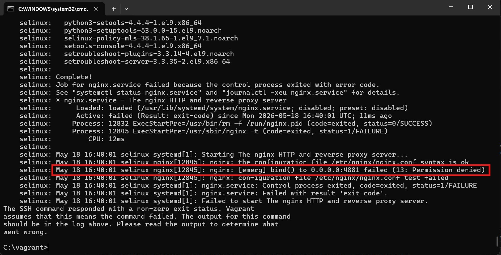
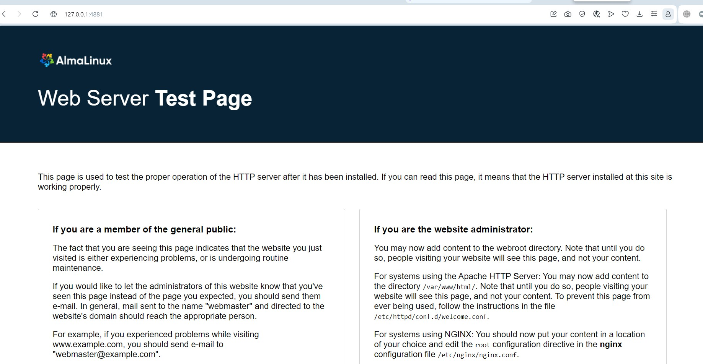

# Практика с SELinux

## Цель

Работать с SELinux: диагностировать проблемы и модифицировать политики SELinux для корректной работы приложений, если это требуется.

## Описание/Пошаговая инструкция выполнения домашнего задания:

1. Запустить Nginx на нестандартном порту 3-мя разными способами:
    * переключатели setsebool
    * добавление нестандартного порта в имеющийся тип
    * формирование и установка модуля SELinux

2. Обеспечить работоспособность приложения при включенном selinux.
    * развернуть приложенный стенд https://github.com/mbfx/otus-linux-adm/tree/master/selinux_dns_problems
    * выяснить причину неработоспособности механизма обновления зоны (см. README)
    * предложить решение (или решения) для данной проблемы
    * выбрать одно из решений для реализации, предварительно обосновав выбор
    * реализовать выбранное решение и продемонстрировать его работоспособность

# Выполнение

## Подготовка

В качестве хоста использовался ПК с Windows 11. Провайдер для Vagrant - VMWare.

## Запуск Nginx на нестандартном порту

Воспользовавшись [репозиторием](https://github.com/Nickmob/vagrant_selinux) из методички, развернём стенд. Ожидаемо получим ошибку:



Прогуляемся по ssh на виртуалку с помощью `vagrant ssh` и переключимся на root, позвав `sudo su`.

### Использование setsebool

Узнаем причину блокировки из логов:

```
cat /var/log/audit/audit.log | grep 4881 | audit2why
```

Увидим следующее:

```
type=AVC msg=audit(1779122401.913:1000): avc:  denied  { name_bind } for  pid=12845 comm="nginx" src=4881 scontext=system_u:system_r:httpd_t:s0 tcontext=system_u:object_r:unreserved_port_t:s0 tclass=tcp_socket permissive=0

        Was caused by:
        The boolean nis_enabled was set incorrectly.
        Description:
        Allow nis to enabled

        Allow access by executing:
        # setsebool -P nis_enabled 1
```

Выполним указанную в конце команду и перезапустим Nginx:

```
setsebool -P nis_enabled 1; systemctl restart nginx
```

На хосте в браузере (я использую Opera) подключимся по адресу `127.0.0.1:4881` и увидим следующую картину:



Очевидно, что Nginx запущен успешно на порту 4881. Вернём всё обратно, чтобы продолжить выполнение задания:

```
setsebool -P nis_enabled 0; systemctl restart nginx
```

Получим не особо информативное сообщение об ошибке в консоли:

```
Job for nginx.service failed because the control process exited with error code.
See "systemctl status nginx.service" and "journalctl -xeu nginx.service" for details.
```

Убедимся, что запуск Nginx ожидаемо потерпел крах, позвав `systemctl status nginx.service`:

```
May 18 17:28:26 selinux systemd[1]: Starting The nginx HTTP and reverse proxy server...
May 18 17:28:26 selinux nginx[13198]: nginx: the configuration file /etc/nginx/nginx.conf syntax is ok
May 18 17:28:26 selinux nginx[13198]: nginx: [emerg] bind() to 0.0.0.0:4881 failed (13: Permission denied)
May 18 17:28:26 selinux nginx[13198]: nginx: configuration file /etc/nginx/nginx.conf test failed
May 18 17:28:26 selinux systemd[1]: nginx.service: Control process exited, code=exited, status=1/FAILURE
May 18 17:28:26 selinux systemd[1]: nginx.service: Failed with result 'exit-code'.
May 18 17:28:26 selinux systemd[1]: Failed to start The nginx HTTP and reverse proxy server.
```

### Добавление нестандартного порта в имеющийся тип

Проверим доступные для http-трафика порты:

```
semanage port -l | grep http
```

Увидим, что порта 4881 среди них ожидаемо нет:

```
http_cache_port_t              tcp      8080, 8118, 8123, 10001-10010
http_cache_port_t              udp      3130
http_port_t                    tcp      80, 81, 443, 488, 8008, 8009, 8443, 9000
pegasus_http_port_t            tcp      5988
pegasus_https_port_t           tcp      5989
```

Добавим порт и перезапустим Nginx:

```
semanage port -a -t http_port_t -p tcp 4881; systemctl restart nginx
```

Снова зайдём с хоста через браузер на `127.0.0.1:4881` и убедимся, что доступ имеется (да, скриншот тот же):


На всякий случай убедимся, что порт действительно добавлен:

```
http_cache_port_t              tcp      8080, 8118, 8123, 10001-10010
http_cache_port_t              udp      3130
http_port_t                    tcp      4881, 80, 81, 443, 488, 8008, 8009, 8443, 9000
pegasus_http_port_t            tcp      5988
pegasus_https_port_t           tcp      5989
```

Теперь удалим порт и снова перезапустим Nginx, узрев уже ставшие родными ошибки:

```
semanage port -d -t http_port_t -p tcp 4881; systemctl restart nginx; systemctl status nginx.service
```

Результат:

```
Job for nginx.service failed because the control process exited with error code.
See "systemctl status nginx.service" and "journalctl -xeu nginx.service" for details.
× nginx.service - The nginx HTTP and reverse proxy server
     Loaded: loaded (/usr/lib/systemd/system/nginx.service; disabled; preset: disabled)
     Active: failed (Result: exit-code) since Mon 2026-05-18 17:45:01 UTC; 16ms ago
   Duration: 3min 55.953s
    Process: 13256 ExecStartPre=/usr/bin/rm -f /run/nginx.pid (code=exited, status=0/SUCCESS)
    Process: 13257 ExecStartPre=/usr/sbin/nginx -t (code=exited, status=1/FAILURE)
        CPU: 12ms

May 18 17:45:01 selinux systemd[1]: Starting The nginx HTTP and reverse proxy server...
May 18 17:45:01 selinux nginx[13257]: nginx: the configuration file /etc/nginx/nginx.conf syntax is ok
May 18 17:45:01 selinux nginx[13257]: nginx: [emerg] bind() to 0.0.0.0:4881 failed (13: Permission denied)
May 18 17:45:01 selinux nginx[13257]: nginx: configuration file /etc/nginx/nginx.conf test failed
May 18 17:45:01 selinux systemd[1]: nginx.service: Control process exited, code=exited, status=1/FAILURE
May 18 17:45:01 selinux systemd[1]: nginx.service: Failed with result 'exit-code'.
May 18 17:45:01 selinux systemd[1]: Failed to start The nginx HTTP and reverse proxy server.
```

### Формирование и установка модуля SELinux

Очистим лог, а затем снова попытаемся запустить Nginx:

```
truncate -s 0 /var/log/audit/audit.log; systemctl start nginx
```

Выполнив `cat /var/log/audit/audit.log | grep nginx `, увидим такой вывод:

```
type=AVC msg=audit(1779127432.588:1134): avc:  denied  { name_bind } for  pid=13469 comm="nginx" src=4881 scontext=system_u:system_r:httpd_t:s0 tcontext=system_u:object_r:unreserved_port_t:s0 tclass=tcp_socket permissive=0
type=SYSCALL msg=audit(1779127432.588:1134): arch=c000003e syscall=49 success=no exit=-13 a0=6 a1=562f8eb886b0 a2=10 a3=7ffd462a7db0 items=0 ppid=1 pid=13469 auid=4294967295 uid=0 gid=0 euid=0 suid=0 fsuid=0 egid=0 sgid=0 fsgid=0 tty=(none) ses=4294967295 comm="nginx" exe="/usr/sbin/nginx" subj=system_u:system_r:httpd_t:s0 key=(null)ARCH=x86_64 SYSCALL=bind AUID="unset" UID="root" GID="root" EUID="root" SUID="root" FSUID="root" EGID="root" SGID="root" FSGID="root"
type=SERVICE_START msg=audit(1779127432.594:1135): pid=1 uid=0 auid=4294967295 ses=4294967295 subj=system_u:system_r:init_t:s0 msg='unit=nginx comm="systemd" exe="/usr/lib/systemd/systemd" hostname=? addr=? terminal=? res=failed'UID="root" AUID="unset"
```

Скормим это `audit2allow`:

```
cat /var/log/audit/audit.log | grep nginx | audit2allow -M nginx
```

Результат:

```
******************** IMPORTANT ***********************
To make this policy package active, execute:

semodule -i nginx.pp

```

Выполним указанную в выводе команду и запустим Nginx, сразу проверив статус, с помощью `systemctl start nginx; systemctl status nginx`. Результат:

```
● nginx.service - The nginx HTTP and reverse proxy server
     Loaded: loaded (/usr/lib/systemd/system/nginx.service; disabled; preset: disabled)
     Active: active (running) since Mon 2026-05-18 18:13:26 UTC; 5s ago
    Process: 13557 ExecStartPre=/usr/bin/rm -f /run/nginx.pid (code=exited, status=0/SUCCESS)
    Process: 13558 ExecStartPre=/usr/sbin/nginx -t (code=exited, status=0/SUCCESS)
    Process: 13559 ExecStart=/usr/sbin/nginx (code=exited, status=0/SUCCESS)
   Main PID: 13560 (nginx)
      Tasks: 2 (limit: 5662)
     Memory: 2.0M
        CPU: 21ms
     CGroup: /system.slice/nginx.service
             ├─13560 "nginx: master process /usr/sbin/nginx"
             └─13561 "nginx: worker process"

May 18 18:13:26 selinux systemd[1]: Starting The nginx HTTP and reverse proxy server...
May 18 18:13:26 selinux nginx[13558]: nginx: the configuration file /etc/nginx/nginx.conf syntax is ok
May 18 18:13:26 selinux nginx[13558]: nginx: configuration file /etc/nginx/nginx.conf test is successful
May 18 18:13:26 selinux systemd[1]: Started The nginx HTTP and reverse proxy server.
```

Подключившись из браузера на хосте, увидим знакомую картину:


Позвав `semodule -l | grep nginx`, можно убедиться, что модуль установлен. Затем сразу удалим его и перезапустим Nginx, чтобы снова вернуться в исходное состояние:

```
semodule -r nginx; systemctl restart nginx
```

## Обеспечение работоспособности приложения при включенном SELinux

По некоторым причинам пришлось переехать с рабочего на личный компьютер с VirtualBox и... нет, всего лишь вложенной виртуализацией. Другие вводные не менялись.

Склонируем указанный в задании репозиторий и поднимем виртуальные машины с помощью Vagrant. 

NB: в Vagrantfile из репозитория указана centos/7, которая уже не поддерживается, и попытка установить пакеты через Ansible заканчивалась падением. Она была заменена на centos/stream9. Также была заменена часть пакетов в playbook'е Ansible (в частности, вместо ntp устанавливается chrony, вместо policycoreutils-python - policycoreutils-python-utils, вместо setools - setools-console). Всё остальное осталось как и было.

После запуска и настройки ВМ в результате вызова `vagrant status` видим следующее:

```
Current machine states:

ns01                      running (virtualbox)
client                    running (virtualbox)

This environment represents multiple VMs. The VMs are all listed
above with their current state. For more information about a specific
VM, run `vagrant status NAME`.
```

Подключимся к клиенту через `vagrant ssh client` и увидим такое приветствие:

```
###############################
### Welcome to the DNS lab! ###
###############################

- Use this client to test the enviroment
- with dig or nslookup. Ex:
    dig @192.168.50.10 ns01.dns.lab

- nsupdate is available in the ddns.lab zone. Ex:
    nsupdate -k /etc/named.zonetransfer.key
    server 192.168.50.10
    zone ddns.lab 
    update add www.ddns.lab. 60 A 192.168.50.15
    send

- rndc is also available to manage the servers
    rndc -c ~/rndc.conf reload

###############################
### Enjoy! ####################
###############################
```

Попробуем обновить зону, воспользовавшись примером из приветствия:

```
[vagrant@client ~]$ nsupdate -k /etc/named.zonetransfer.key 
> server 192.168.50.10
> zone ddns.lab
> update add www.ddns.lab. 60 A 192.168.50.15
> send
update failed: SERVFAIL
```

Очевидно, попытка неудачная. Выйдем из nsupdate с помощью `quit`, перейдём в режим root'а (`sudo su`) и пойдём смотреть логи:

```
cat /var/log/audit/audit.log
```

Результат:

```
...
type=USER_START msg=audit(1779396967.641:701): pid=4342 uid=1000 auid=1000 ses=4 subj=unconfined_u:unconfined_r:unconfined_t:s0-s0:c0.c1023 msg='op=PAM:session_open grantors=pam_keyinit,pam_limits,pam_systemd,pam_unix acct="root" exe="/usr/bin/sudo" hostname=client addr=? terminal=/dev/pts/0 res=success'UID="vagrant" AUID="vagrant"
type=USER_AUTH msg=audit(1779396967.680:702): pid=4345 uid=0 auid=1000 ses=4 subj=unconfined_u:unconfined_r:unconfined_t:s0-s0:c0.c1023 msg='op=PAM:authentication grantors=pam_rootok acct="root" exe="/usr/bin/su" hostname=client addr=? terminal=/dev/pts/1 res=success'UID="root" AUID="vagrant"
type=USER_ACCT msg=audit(1779396967.684:703): pid=4345 uid=0 auid=1000 ses=4 subj=unconfined_u:unconfined_r:unconfined_t:s0-s0:c0.c1023 msg='op=PAM:accounting grantors=pam_succeed_if acct="root" exe="/usr/bin/su" hostname=client addr=? terminal=/dev/pts/1 res=success'UID="root" AUID="vagrant"
type=CRED_ACQ msg=audit(1779396967.686:704): pid=4345 uid=0 auid=1000 ses=4 subj=unconfined_u:unconfined_r:unconfined_t:s0-s0:c0.c1023 msg='op=PAM:setcred grantors=pam_rootok acct="root" exe="/usr/bin/su" hostname=client addr=? terminal=/dev/pts/1 res=success'UID="root" AUID="vagrant"
type=USER_START msg=audit(1779396967.694:705): pid=4345 uid=0 auid=1000 ses=4 subj=unconfined_u:unconfined_r:unconfined_t:s0-s0:c0.c1023 msg='op=PAM:session_open grantors=pam_keyinit,pam_limits,pam_systemd,pam_unix,pam_umask,pam_xauth acct="root" exe="/usr/bin/su" hostname=client addr=? terminal=/dev/pts/1 res=success'UID="root" AUID="vagrant"
```

Из логов мало что понятно, поэтому попробуем скормить их `audit2why`:

```
cat /var/log/audit/audit.log | audit2why
```

Результат:

```
...
type=AVC msg=audit(1779396229.449:380): avc:  denied  { dac_override } for  pid=2696 comm="20-chrony-dhcp" capability=1  scontext=system_u:system_r:NetworkManager_dispatcher_chronyc_t:s0 tcontext=system_u:system_r:NetworkManager_dispatcher_chronyc_t:s0 tclass=capability permissive=0

	Was caused by:
		Missing type enforcement (TE) allow rule.

		You can use audit2allow to generate a loadable module to allow this access.

type=AVC msg=audit(1779396232.853:395): avc:  denied  { dac_read_search } for  pid=2793 comm="20-chrony-dhcp" capability=2  scontext=system_u:system_r:NetworkManager_dispatcher_chronyc_t:s0 tcontext=system_u:system_r:NetworkManager_dispatcher_chronyc_t:s0 tclass=capability permissive=0

	Was caused by:
		Missing type enforcement (TE) allow rule.

		You can use audit2allow to generate a loadable module to allow this access.

type=AVC msg=audit(1779396232.853:395): avc:  denied  { dac_override } for  pid=2793 comm="20-chrony-dhcp" capability=1  scontext=system_u:system_r:NetworkManager_dispatcher_chronyc_t:s0 tcontext=system_u:system_r:NetworkManager_dispatcher_chronyc_t:s0 tclass=capability permissive=0

	Was caused by:
		Missing type enforcement (TE) allow rule.

		You can use audit2allow to generate a loadable module to allow this access.
```

Не уверен, что это относится напрямую к заданию, но с помощью `audit2allow` и `semodule` исправим это дело:

```
[root@client vagrant]# cat /var/log/audit/audit.log | audit2allow -M my_fix
******************** IMPORTANT ***********************
To make this policy package active, execute:

semodule -i my_fix.pp

[root@client vagrant]# semodule -i my_fix.pp
```

На всякий случай повторно проверим возможность обновления зоны (на этот раз из-под root'а). Картина та же:

```
[root@client vagrant]# nsupdate -k /etc/named.zonetransfer.key 
> server 192.168.50.10
> zone ddns.lab
> update add www.ddns.lab. 60 A 192.168.50.15
> send
update failed: SERVFAIL
```

Подключимся теперь (в другом терминале) к ns01 (`vagrant ssh ns01`) и проверим логи там:

```
[root@ns01 vagrant]# cat /var/log/audit/audit.log | audit2why
...
type=AVC msg=audit(1779398435.680:676): avc:  denied  { write } for  pid=553 comm="isc-net-0000" name="dynamic" dev="sda1" ino=132188 scontext=system_u:system_r:named_t:s0 tcontext=unconfined_u:object_r:named_conf_t:s0 tclass=dir permissive=0

	Was caused by:
		Missing type enforcement (TE) allow rule.

		You can use audit2allow to generate a loadable module to allow this access.
```

Процесс работает в SELinux-домене `named_t`, а каталог помечен как `named_conf_t`.

Судя по всему, можно было бы обойтись `audit2allow` для данного фикса (хотя я и не проверял). Но это ~~слишком просто~~ полностью аналогично последнему пункту первой части задания, поэтому пойдём путём, описанным в методичке.

Проверим зону `localhost`:

```
[root@ns01 vagrant]# ls -alZ /var/named/named.localhost
-rw-r-----. 1 root named system_u:object_r:named_zone_t:s0 152 Apr 17 10:58 /var/named/named.localhost
```

Видим, что тип `named_zone_t`. В то же время:

```
[root@ns01 vagrant]# ls -laZ /etc/named
total 28
drw-rwx---.  3 root named system_u:object_r:named_conf_t:s0     4096 May 19 23:28 .
drwxr-xr-x. 88 root root  system_u:object_r:etc_t:s0            4096 May 21 20:42 ..
drw-rwx---.  2 root named unconfined_u:object_r:named_conf_t:s0 4096 May 19 23:28 dynamic
-rw-rw----.  1 root named system_u:object_r:named_conf_t:s0      784 May 19 23:28 named.50.168.192.rev
-rw-rw----.  1 root named system_u:object_r:named_conf_t:s0      610 May 19 23:27 named.dns.lab
-rw-rw----.  1 root named system_u:object_r:named_conf_t:s0      609 May 19 23:27 named.dns.lab.view1
-rw-rw----.  1 root named system_u:object_r:named_conf_t:s0      657 May 19 23:28 named.newdns.lab
```

Видим, что здесь тип `named_conf_t`, т.е. контекст разный.

Заменим тип контекста безопасности для каталога `/etc/named`:

```
chcon -R -t named_zone_t /etc/named
```

Проверим, что изменения применились:

```
[root@ns01 vagrant]# ls -laZ /etc/named
total 28
drw-rwx---.  3 root named system_u:object_r:named_zone_t:s0     4096 May 19 23:28 .
drwxr-xr-x. 88 root root  system_u:object_r:etc_t:s0            4096 May 21 20:42 ..
drw-rwx---.  2 root named unconfined_u:object_r:named_zone_t:s0 4096 May 19 23:28 dynamic
-rw-rw----.  1 root named system_u:object_r:named_zone_t:s0      784 May 19 23:28 named.50.168.192.rev
-rw-rw----.  1 root named system_u:object_r:named_zone_t:s0      610 May 19 23:27 named.dns.lab
-rw-rw----.  1 root named system_u:object_r:named_zone_t:s0      609 May 19 23:27 named.dns.lab.view1
-rw-rw----.  1 root named system_u:object_r:named_zone_t:s0      657 May 19 23:28 named.newdns.lab
```

Вернёмся к клиенту и снова попробуем внести изменения с его стороны:

```
[root@client vagrant]# nsupdate -k /etc/named.zonetransfer.key 
> server 192.168.50.10
> zone ddns.lab
> update add www.ddns.lab. 60 A 192.168.50.15
> send
> quit
```

Ошибки не случилось. Проведём диагностику:

```
[root@client vagrant]# dig ddns.lab

; <<>> DiG 9.16.23-RH <<>> ddns.lab
;; global options: +cmd
;; Got answer:
;; ->>HEADER<<- opcode: QUERY, status: NXDOMAIN, id: 29465
;; flags: qr rd ra; QUERY: 1, ANSWER: 0, AUTHORITY: 1, ADDITIONAL: 1

;; OPT PSEUDOSECTION:
; EDNS: version: 0, flags:; udp: 65494
;; QUESTION SECTION:
;ddns.lab.			IN	A

;; AUTHORITY SECTION:
.			86338	IN	SOA	a.root-servers.net. nstld.verisign-grs.com. 2026052102 1800 900 604800 86400

;; Query time: 76 msec
;; SERVER: 10.0.2.3#53(10.0.2.3)
;; WHEN: Thu May 21 21:43:12 UTC 2026
;; MSG SIZE  rcvd: 112
```

Видим что-то непонятное (откуда вообще взялся 10.0.2.3?). Проверим `/etc/resolv.conf`:

```
# Generated by NetworkManager
nameserver 10.0.2.3
```

Тут я слегка завтыкал и обратился за помошью к ChatGPT, который мне уверенно заявил, что это результат перезаписи файла провайдером (VirtualBox'ом то есть), и что такое происходит часто. Заменим вручную с помощью Vim адрес на наш (192.168.50.10) и проведём диагностику ещё раз:

```
[root@client vagrant]# dig @192.168.50.10 www.ddns.lab

; <<>> DiG 9.16.23-RH <<>> @192.168.50.10 www.ddns.lab
; (1 server found)
;; global options: +cmd
;; Got answer:
;; ->>HEADER<<- opcode: QUERY, status: NOERROR, id: 11514
;; flags: qr aa rd ra; QUERY: 1, ANSWER: 1, AUTHORITY: 0, ADDITIONAL: 1

;; OPT PSEUDOSECTION:
; EDNS: version: 0, flags:; udp: 1232
; COOKIE: ea5778c0b2bce05a010000006a0f7f768c284fec1e7a2606 (good)
;; QUESTION SECTION:
;www.ddns.lab.			IN	A

;; ANSWER SECTION:
www.ddns.lab.		60	IN	A	192.168.50.15

;; Query time: 5 msec
;; SERVER: 192.168.50.10#53(192.168.50.10)
;; WHEN: Thu May 21 21:56:06 UTC 2026
;; MSG SIZE  rcvd: 85
```

Теперь видим, что ошибок нет. Перезагрузим обе ВМ (`reboot now`) и проверим, что настройки сохранились:

```
[root@client vagrant]# dig @192.168.50.10 www.ddns.lab

; <<>> DiG 9.16.23-RH <<>> @192.168.50.10 www.ddns.lab
; (1 server found)
;; global options: +cmd
;; Got answer:
;; ->>HEADER<<- opcode: QUERY, status: NOERROR, id: 46044
;; flags: qr aa rd ra; QUERY: 1, ANSWER: 1, AUTHORITY: 0, ADDITIONAL: 1

;; OPT PSEUDOSECTION:
; EDNS: version: 0, flags:; udp: 1232
; COOKIE: 1fb57c64462df326010000006a0f807a224cb9e603a71042 (good)
;; QUESTION SECTION:
;www.ddns.lab.			IN	A

;; ANSWER SECTION:
www.ddns.lab.		60	IN	A	192.168.50.15

;; Query time: 4 msec
;; SERVER: 192.168.50.10#53(192.168.50.10)
;; WHEN: Thu May 21 22:00:26 UTC 2026
;; MSG SIZE  rcvd: 85
```

После перезагрузки всё работает.
