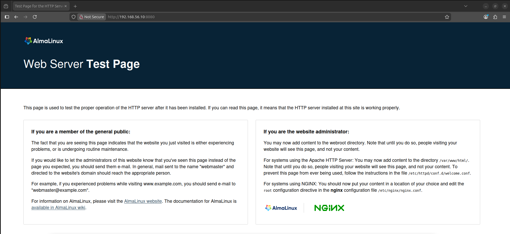

# Первые шаги с Ansible

## Цель

Написать первые шаги с Ansible

## Описание/Пошаговая инструкция выполнения домашнего задания:

Подготовить стенд на Vagrant как минимум с одним сервером. На этом сервере, используя Ansible, необходимо развернуть Nginx со следующими условиями:

* необходимо использовать модуль yum/apt
* конфигурационные файлы должны быть взяты из шаблона jinja2 с переменными
* после установки nginx должен быть в режиме enabled в systemd
* должен быть использован notify для старта nginx после установки
* сайт должен слушать на нестандартном порту — 8080, для этого использовать переменные в Ansible

# Выполнение

В качестве хоста использовалась ВМ (с включённой вложенной виртуализацией) под управлением Ubuntu 24.04. Провайдер для Vagrant - VirtualBox. В качестве гостевой ОС использовалась Alma Linux 9.

* [Vagrantfile](./Vagrantfile)
* [Ansible-playbook](./ansible/start.yml) для установки, настройки и старта Nginx
* [Шаблон](./ansible/my-site.conf.j2) conf-файла для Nginx

Результат подключения с хостовой системы:

