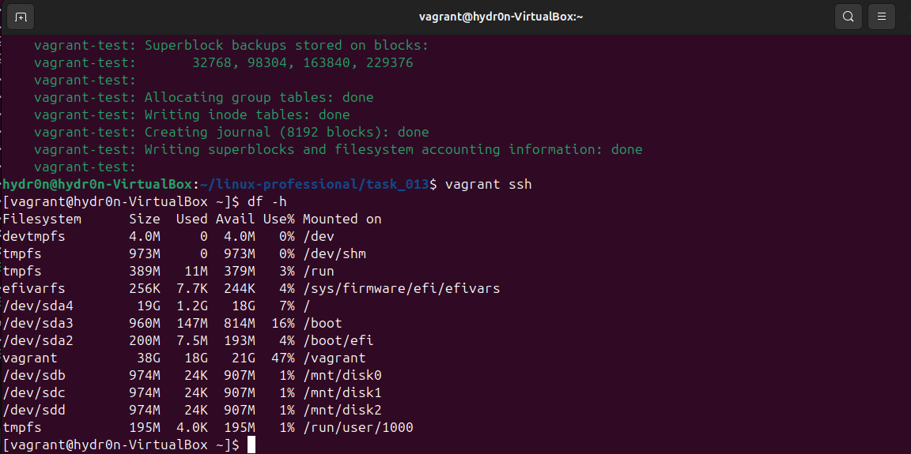

# Расширенная настройка дисков и сетей

## Цель

Научиться добавлять диски и настраивать сетевые соединения

## Описание/Пошаговая инструкция выполнения домашнего задания:

1. Подготовка окружения:

* убедитесть, что установле VirtualBox и Vagrant
* создайте директорию для проекта

2. Создать базовую виртуальную машину:

* использовать можно любой образ.
* настроите память ВМ: 1024 МБ.

3. Добавление дисков:

* Добавьте пару виртуальных диска размером 1 ГБ каждый.

4. Настройка сети:
* настройте проброс 80 порта с гостевой системы на порт 8080 хостовой системы

5. Провижининг:

* форматирует добавленные диски в файловую систему ext4
* создает точки монтирования /mnt/disk1 и /mnt/disk2
* монтирует диски в указанные директории.
* добавляет записи в /etc/fstab для автоматического монтирования при загрузке.

# Выполнение

В качестве хоста использовалась ВМ (с включённой вложенной виртуализацией) под управлением Ubuntu 24.04. Провайдер для Vagrant - VirtualBox. В качестве гостевой ОС использовалась Alma Linux 9.

* [Vagrantfile](./Vagrantfile)
* [Provision](./provision.sh) для выполнения 5-го пункта задания

Результат выполнения `netstat -tulpn | grep 8080` на хостовой системы:

Результат выполнения `df -h` на хостовой системы:

